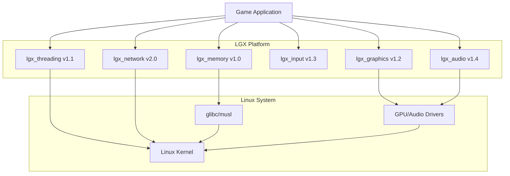
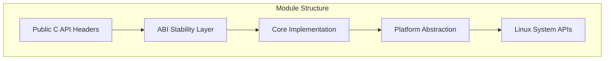
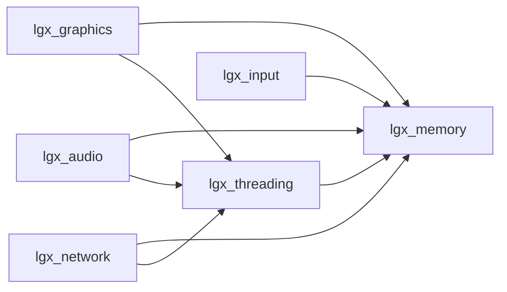
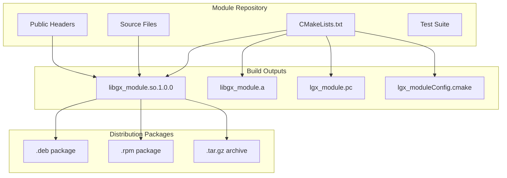

# Design Document: LGX Platform Architecture

## Overview

The LGX Platform Architecture defines the technical foundation for building a stable, high-performance, cross-distribution gaming platform for Linux. This design establishes patterns and practices that will be applied consistently across all LGX modules (Memory, Threading, Graphics, Input, Audio, Networking).

The architecture is built on three core principles:

1. **Stability First**: ABI stability through semantic versioning, symbol versioning, and automated compatibility testing ensures games continue working across platform updates
2. **Performance Without Compromise**: Zero-cost abstractions, cache-friendly data structures, and link-time optimization deliver DirectX-level performance
3. **Universal Compatibility**: C ABI, standard Linux APIs, and comprehensive CI testing enable one build to run on all major distributions and architectures

This design serves as the architectural blueprint for implementing v1.1 Threading and all subsequent modules, ensuring consistency and quality across the entire platform.

## Architecture

### System Context



The LGX platform sits between game applications and the Linux system, providing stable, versioned interfaces that abstract away distribution differences and kernel API variations.

### Module Architecture

Each LGX module follows a consistent layered architecture:



**Public C API Headers**: Stable interface using C linkage, opaque handles, and documented error codes
**ABI Stability Layer**: Symbol versioning and compatibility shims for maintaining backward compatibility
**Core Implementation**: Module-specific logic implemented in C or C++ (internal only)
**Platform Abstraction**: Thin layer handling distribution and architecture differences
**Linux System APIs**: Direct system calls, glibc/musl, and kernel interfaces

### Module Dependency Graph



Dependencies flow from higher-level modules to foundational modules. The Memory module has no dependencies, making it the foundation. Threading depends only on Memory. Graphics, Audio, and Networking build on both Memory and Threading.

### Build System Architecture



Each module builds independently, producing shared libraries, static libraries, pkg-config files, and CMake configuration files. CPack generates distribution-specific packages.

## Components and Interfaces

### Module Structure

Each module follows a standardized directory structure:

```
lgx_module/
├── include/
│   └── lgx/
│       └── module.h          # Public API header
├── src/
│   ├── module.c              # Core implementation
│   ├── module_internal.h     # Private headers
│   └── platform/
│       ├── linux_generic.c   # Generic Linux implementation
│       ├── x86_64.c          # x86_64 optimizations
│       └── aarch64.c         # ARM64 optimizations
├── tests/
│   ├── unit/                 # Unit tests
│   ├── integration/          # Integration tests
│   └── property/             # Property-based tests
├── docs/
│   ├── api.md                # API documentation
│   └── examples/             # Usage examples
├── cmake/
│   └── lgx_moduleConfig.cmake.in
├── CMakeLists.txt
├── lgx_module.pc.in          # pkg-config template
├── lgx_module.map            # Symbol version script
└── README.md
```

### Public API Interface Pattern

All modules follow this interface pattern:

```c
// include/lgx/module.h
#ifndef LGX_MODULE_H
#define LGX_MODULE_H

#ifdef __cplusplus
extern "C" {
#endif

#include <stddef.h>
#include <stdint.h>

// Opaque handle type
typedef struct lgx_module_object_t* lgx_module_object_t;

// Error codes
typedef enum {
    LGX_MODULE_SUCCESS = 0,
    LGX_MODULE_ERROR_INVALID_PARAM = -1,
    LGX_MODULE_ERROR_OUT_OF_MEMORY = -2,
    LGX_MODULE_ERROR_NOT_INITIALIZED = -3,
    // ... more error codes
} lgx_module_error_e;

// Configuration structure (exposed layout for stack allocation)
typedef struct {
    uint32_t flags;
    size_t buffer_size;
    // ... configuration fields
} lgx_module_config_t;

// Constructor
lgx_module_error_e lgx_module_create(
    const lgx_module_config_t* config,
    lgx_module_object_t* out_object
);

// Destructor
void lgx_module_destroy(lgx_module_object_t object);

// Operations
lgx_module_error_e lgx_module_operation(
    lgx_module_object_t object,
    /* parameters */
);

// Error handling
const char* lgx_module_error_string(lgx_module_error_e error);
const char* lgx_module_get_last_error_detail(void);

// Version query
void lgx_module_version(uint32_t* major, uint32_t* minor, uint32_t* patch);

#ifdef __cplusplus
}
#endif

#endif // LGX_MODULE_H
```

### Symbol Versioning Pattern

Each module uses ELF symbol versioning for ABI stability:

```
# lgx_module.map
LGX_MODULE_1.0 {
    global:
        lgx_module_create;
        lgx_module_destroy;
        lgx_module_operation;
        lgx_module_error_string;
        lgx_module_version;
    local:
        *;
};

LGX_MODULE_1.1 {
    global:
        lgx_module_new_operation;
} LGX_MODULE_1.0;
```

New versions inherit previous versions, maintaining all old symbols while adding new ones.

### CMake Module Pattern

Each module provides CMake configuration for easy integration:

```cmake
# CMakeLists.txt
cmake_minimum_required(VERSION 3.20)
project(lgx_module VERSION 1.0.0 LANGUAGES C)

# Options
option(LGX_MODULE_BUILD_TESTS "Build tests" ON)
option(LGX_MODULE_BUILD_SHARED "Build shared library" ON)
option(LGX_MODULE_BUILD_STATIC "Build static library" ON)

# Dependencies
find_package(lgx_memory 1.0 REQUIRED)

# Library target
add_library(lgx_module)
target_sources(lgx_module PRIVATE src/module.c)
target_include_directories(lgx_module
    PUBLIC
        $<BUILD_INTERFACE:${CMAKE_CURRENT_SOURCE_DIR}/include>
        $<INSTALL_INTERFACE:include>
)
target_link_libraries(lgx_module PUBLIC lgx::memory)

# Symbol versioning
if(UNIX AND NOT APPLE)
    target_link_options(lgx_module PRIVATE
        -Wl,--version-script=${CMAKE_CURRENT_SOURCE_DIR}/lgx_module.map
    )
endif()

# Installation
install(TARGETS lgx_module EXPORT lgx_moduleTargets)
install(DIRECTORY include/ DESTINATION include)

# CMake config
include(CMakePackageConfigHelpers)
configure_package_config_file(
    cmake/lgx_moduleConfig.cmake.in
    ${CMAKE_CURRENT_BINARY_DIR}/lgx_moduleConfig.cmake
    INSTALL_DESTINATION lib/cmake/lgx_module
)
install(FILES ${CMAKE_CURRENT_BINARY_DIR}/lgx_moduleConfig.cmake
    DESTINATION lib/cmake/lgx_module
)

# pkg-config
configure_file(lgx_module.pc.in lgx_module.pc @ONLY)
install(FILES ${CMAKE_CURRENT_BINARY_DIR}/lgx_module.pc
    DESTINATION lib/pkgconfig
)
```

### Error Handling Pattern

All modules use consistent error handling:

```c
// Thread-local error detail storage
static _Thread_local char error_detail_buffer[256];

lgx_module_error_e lgx_module_operation(lgx_module_object_t object) {
    if (object == NULL) {
        snprintf(error_detail_buffer, sizeof(error_detail_buffer),
                 "lgx_module_operation: object parameter is NULL");
        return LGX_MODULE_ERROR_INVALID_PARAM;
    }
    
    // ... operation logic
    
    if (failure_condition) {
        snprintf(error_detail_buffer, sizeof(error_detail_buffer),
                 "lgx_module_operation: failed because %s", reason);
        return LGX_MODULE_ERROR_OPERATION_FAILED;
    }
    
    return LGX_MODULE_SUCCESS;
}

const char* lgx_module_get_last_error_detail(void) {
    return error_detail_buffer;
}
```

### Thread Safety Pattern

Modules document and implement thread safety guarantees:

```c
// Thread-safe: Can be called concurrently from multiple threads
lgx_module_error_e lgx_module_thread_safe_operation(
    lgx_module_object_t object
) {
    // Uses internal locking or atomic operations
    pthread_mutex_lock(&object->mutex);
    // ... operation
    pthread_mutex_unlock(&object->mutex);
    return LGX_MODULE_SUCCESS;
}

// Thread-compatible: Safe if different threads use different objects
lgx_module_error_e lgx_module_thread_compatible_operation(
    lgx_module_object_t object
) {
    // No locking needed - operates only on object state
    object->field = new_value;
    return LGX_MODULE_SUCCESS;
}

// Thread-unsafe: Must be externally synchronized
lgx_module_error_e lgx_module_thread_unsafe_operation(
    lgx_module_object_t object
) {
    // Modifies shared state without synchronization
    // Caller must ensure exclusive access
    return LGX_MODULE_SUCCESS;
}
```

## Data Models

### Module Metadata

Each module maintains metadata for discovery and dependency resolution:

```c
typedef struct {
    const char* name;              // "lgx_memory"
    uint32_t version_major;        // 1
    uint32_t version_minor;        // 0
    uint32_t version_patch;        // 0
    const char* abi_version;       // "LGX_MEMORY_1.0"
    
    // Dependencies
    struct {
        const char* name;
        uint32_t min_version_major;
        uint32_t min_version_minor;
        uint32_t max_version_major;
    } dependencies[8];
    size_t dependency_count;
    
    // Capabilities
    uint32_t capability_flags;
    const char* supported_architectures[4];
    size_t architecture_count;
} lgx_module_metadata_t;
```

### Version Information

Version information follows semantic versioning:

```c
typedef struct {
    uint32_t major;  // Breaking changes
    uint32_t minor;  // Backward-compatible additions
    uint32_t patch;  // Backward-compatible fixes
    const char* prerelease;  // "alpha", "beta", "rc1", or NULL
    const char* build_metadata;  // Git commit hash, build date
} lgx_version_t;
```

### Configuration Structures

Configuration structures are exposed for stack allocation but designed for forward compatibility:

```c
// Version 1.0
typedef struct {
    uint32_t struct_size;  // sizeof(lgx_module_config_t)
    uint32_t flags;
    size_t buffer_size;
    // Future fields can be added here
} lgx_module_config_t;

// Initialization with forward compatibility
lgx_module_config_t config = {
    .struct_size = sizeof(lgx_module_config_t),
    .flags = LGX_MODULE_FLAG_DEFAULT,
    .buffer_size = 4096
};
```

The `struct_size` field enables the library to detect which version of the structure the caller is using, allowing new fields to be added without breaking ABI.

### Build Configuration

Build configuration is captured in generated headers:

```c
// lgx_module_config.h (generated by CMake)
#ifndef LGX_MODULE_CONFIG_H
#define LGX_MODULE_CONFIG_H

#define LGX_MODULE_VERSION_MAJOR 1
#define LGX_MODULE_VERSION_MINOR 0
#define LGX_MODULE_VERSION_PATCH 0
#define LGX_MODULE_VERSION_STRING "1.0.0"

#define LGX_MODULE_ABI_VERSION "LGX_MODULE_1.0"

// Platform detection
#if defined(__x86_64__) || defined(_M_X64)
    #define LGX_MODULE_ARCH_X86_64 1
#elif defined(__aarch64__) || defined(_M_ARM64)
    #define LGX_MODULE_ARCH_AARCH64 1
#endif

// Compiler detection
#if defined(__GNUC__)
    #define LGX_MODULE_COMPILER_GCC 1
#elif defined(__clang__)
    #define LGX_MODULE_COMPILER_CLANG 1
#endif

#endif // LGX_MODULE_CONFIG_H
```

### Testing Metadata

Test metadata enables property-based testing and CI integration:

```c
typedef struct {
    const char* test_name;
    const char* property_description;
    uint32_t property_number;  // References design doc property
    const char* validates_requirements;  // "1.1, 1.2, 2.3"
    size_t iteration_count;  // Minimum 100 for property tests
    bool is_property_test;
    bool is_integration_test;
} lgx_test_metadata_t;
```

## Correctness Properties


*A property is a characteristic or behavior that should hold true across all valid executions of a system—essentially, a formal statement about what the system should do. Properties serve as the bridge between human-readable specifications and machine-verifiable correctness guarantees.*

### Property 1: Module Naming Convention

*For any* LGX module, the module name SHALL follow the pattern `lgx_{module_name}` where `{module_name}` uses lowercase letters and underscores only.

**Validates: Requirements 1.2**

### Property 2: Module Manifest Validity

*For any* LGX module, the module manifest file SHALL exist and contain valid entries for name, version (in semantic versioning format), and dependencies (with version constraints).

**Validates: Requirements 1.4, 3.1, 3.2**

### Property 3: Build System Integration

*For any* LGX module, the build system SHALL generate both a pkg-config file and a CMake config file that enable automatic discovery and configuration.

**Validates: Requirements 2.2, 13.3**

### Property 4: Module Availability Query

*For any* optional module, the platform SHALL provide a runtime query function that correctly reports whether the module is available, returning consistent results across multiple calls.

**Validates: Requirements 2.4**

### Property 5: Semantic Versioning Format

*For any* module version string, it SHALL match the semantic versioning pattern `MAJOR.MINOR.PATCH` where each component is a non-negative integer.

**Validates: Requirements 3.2**

### Property 6: API Naming Conventions

*For any* public symbol in an LGX module:
- Function and type names SHALL use snake_case
- Constants and macros SHALL use SCREAMING_SNAKE_CASE
- Opaque handle types SHALL have suffix `_t`
- Enum types SHALL have suffix `_e`
- Function names SHALL follow verb-noun pattern
- All symbols SHALL have prefix `lgx_{module}_`

**Validates: Requirements 4.1, 4.2, 4.3, 4.4, 4.5, 4.6**

### Property 7: C ABI Compatibility

*For any* public API in an LGX module:
- All functions SHALL use C linkage (no C++ name mangling)
- All parameter and return types SHALL be C-compatible (no C++ classes, templates, or exceptions)
- Complex objects SHALL be represented as opaque handles (pointers to incomplete types)
- Every opaque type SHALL have corresponding constructor and destructor functions
- Structs requiring ABI stability SHALL not expose their layout in public headers

**Validates: Requirements 5.1, 5.2, 5.3, 5.4, 5.5**

### Property 8: Error Handling Consistency

*For any* LGX module:
- All functions that can fail SHALL return an error code type
- The module SHALL define an error enum with success value of 0
- All error codes SHALL be negative integers
- An error-to-string function SHALL exist and return non-empty strings for all error codes
- A thread-local error detail function SHALL exist and maintain separate error details per thread

**Validates: Requirements 6.1, 6.2, 6.3, 6.4, 6.5, 6.7**

### Property 9: Thread Safety Guarantees

*For any* function documented as thread-safe, concurrent calls from multiple threads SHALL execute correctly without data races, crashes, or incorrect results.

**Validates: Requirements 7.3**

### Property 10: Thread Compatibility Guarantees

*For any* function documented as thread-compatible, concurrent calls from multiple threads operating on different objects SHALL execute correctly without interference.

**Validates: Requirements 7.4**

### Property 11: Symbol Versioning

*For any* public symbol in an LGX shared library on Linux, the symbol SHALL have an ELF version tag indicating its introduction version (e.g., `LGX_MODULE_1.0`).

**Validates: Requirements 9.1, 9.3**

### Property 12: Reference Counting Correctness

*For any* shared resource using reference counting, incrementing the reference count SHALL prevent resource destruction, and decrementing to zero SHALL trigger resource cleanup exactly once.

**Validates: Requirements 12.4**

### Property 13: CMake Minimum Version

*For any* LGX module CMakeLists.txt file, the `cmake_minimum_required` directive SHALL specify version 3.20 or later.

**Validates: Requirements 13.2**

### Property 14: Shared Library Soname

*For any* LGX shared library, the soname SHALL match the pattern `libgx_{module}.so.{MAJOR}` where MAJOR is the major version number.

**Validates: Requirements 15.7**

### Property 15: Architecture-Neutral Public APIs

*For any* public API header, the code SHALL not use architecture-specific types, intrinsics, or conditional compilation that would change the API surface across architectures.

**Validates: Requirements 17.6**

### Property 16: Compiler Extension Avoidance

*For any* public API header, the code SHALL not use compiler-specific extensions (GCC/Clang attributes, MSVC pragmas, etc.) that would prevent compilation with standard-compliant compilers.

**Validates: Requirements 18.6**

### Property 17: Custom Allocator Support

*For any* API function that performs memory allocation, if a custom allocator parameter is provided, all allocations and deallocations SHALL use the custom allocator instead of the default allocator.

**Validates: Requirements 20.5**

### Property 18: Unit Test Coverage

*For any* public API function, at least one unit test SHALL exist that exercises the function's primary behavior.

**Validates: Requirements 22.2**

### Property 19: Error Condition Testing

*For any* public API function that can return error codes, at least one unit test SHALL exist that triggers each documented error condition.

**Validates: Requirements 22.4**

### Property 20: Property Test Iteration Count

*For any* property-based test in an LGX module, the test configuration SHALL specify a minimum of 100 iterations to ensure adequate input coverage.

**Validates: Requirements 24.2**

### Property 21: Input Validation

*For any* public API function, passing NULL for required pointer parameters or out-of-range values for numeric parameters SHALL return an appropriate error code without crashing.

**Validates: Requirements 27.1**

## Error Handling

### Error Code Design

All modules follow a consistent error handling pattern:

```c
// Common error codes across all modules
#define LGX_SUCCESS 0
#define LGX_ERROR_INVALID_PARAM -1
#define LGX_ERROR_OUT_OF_MEMORY -2
#define LGX_ERROR_NOT_INITIALIZED -3
#define LGX_ERROR_ALREADY_INITIALIZED -4
#define LGX_ERROR_OPERATION_FAILED -5

// Module-specific error codes start at -100
typedef enum {
    LGX_MODULE_SUCCESS = LGX_SUCCESS,
    LGX_MODULE_ERROR_INVALID_PARAM = LGX_ERROR_INVALID_PARAM,
    LGX_MODULE_ERROR_OUT_OF_MEMORY = LGX_ERROR_OUT_OF_MEMORY,
    LGX_MODULE_ERROR_NOT_INITIALIZED = LGX_ERROR_NOT_INITIALIZED,
    LGX_MODULE_ERROR_ALREADY_INITIALIZED = LGX_ERROR_ALREADY_INITIALIZED,
    LGX_MODULE_ERROR_OPERATION_FAILED = LGX_ERROR_OPERATION_FAILED,
    
    // Module-specific errors
    LGX_MODULE_ERROR_SPECIFIC_CONDITION = -100,
    // ...
} lgx_module_error_e;
```

### Error Context

Thread-local error details provide additional context:

```c
// Thread-local storage for detailed error messages
static _Thread_local char g_error_detail[256] = {0};

void lgx_module_set_error_detail(const char* format, ...) {
    va_list args;
    va_start(args, format);
    vsnprintf(g_error_detail, sizeof(g_error_detail), format, args);
    va_end(args);
}

const char* lgx_module_get_last_error_detail(void) {
    return g_error_detail;
}
```

### Error Handling Best Practices

1. **Always check return values**: Never ignore error codes
2. **Use error details for debugging**: Call `get_last_error_detail()` when an error occurs
3. **Clean up on error**: Ensure resources are freed even when errors occur
4. **Document all error conditions**: Every function documents which errors it can return

### Error Recovery Strategies

```c
// Example: Retry with fallback
lgx_module_error_e err = lgx_module_operation(object, params);
if (err == LGX_MODULE_ERROR_OUT_OF_MEMORY) {
    // Try with smaller parameters
    params.size /= 2;
    err = lgx_module_operation(object, params);
}

if (err != LGX_MODULE_SUCCESS) {
    fprintf(stderr, "Operation failed: %s\n", 
            lgx_module_error_string(err));
    fprintf(stderr, "Details: %s\n",
            lgx_module_get_last_error_detail());
    // Handle error appropriately
}
```

## Testing Strategy

### Testing Philosophy

LGX employs a comprehensive testing strategy combining three complementary approaches:

1. **Unit Tests**: Verify individual functions and components in isolation
2. **Integration Tests**: Verify modules work correctly together
3. **Property-Based Tests**: Verify universal properties hold across all inputs

This multi-layered approach ensures both concrete correctness (unit tests) and general correctness (property tests).

### Unit Testing

**Framework**: Google Test (C++) or a C testing framework like Unity

**Coverage Requirements**:
- Minimum 80% code coverage per module
- Every public API function must have tests
- Every error condition must be tested
- Edge cases must be explicitly tested

**Example Unit Test**:

```cpp
TEST(LgxModule, CreateDestroy) {
    lgx_module_config_t config = {
        .struct_size = sizeof(lgx_module_config_t),
        .flags = LGX_MODULE_FLAG_DEFAULT,
        .buffer_size = 4096
    };
    
    lgx_module_object_t object = NULL;
    lgx_module_error_e err = lgx_module_create(&config, &object);
    
    ASSERT_EQ(err, LGX_MODULE_SUCCESS);
    ASSERT_NE(object, nullptr);
    
    lgx_module_destroy(object);
}

TEST(LgxModule, CreateWithNullConfig) {
    lgx_module_object_t object = NULL;
    lgx_module_error_e err = lgx_module_create(NULL, &object);
    
    ASSERT_EQ(err, LGX_MODULE_ERROR_INVALID_PARAM);
    ASSERT_EQ(object, nullptr);
}
```

### Integration Testing

**Purpose**: Verify modules work correctly when combined

**Test Scenarios**:
- Module A depends on Module B: verify A can use B's APIs
- Multiple modules sharing resources: verify no conflicts
- Thread safety across modules: verify concurrent access is safe
- Transitive dependencies: verify A→B→C dependency chain works

**Example Integration Test**:

```cpp
TEST(Integration, ThreadingUsesMemory) {
    // Initialize memory module
    lgx_memory_init();
    
    // Create threading object (internally uses memory module)
    lgx_threading_config_t config = {
        .struct_size = sizeof(lgx_threading_config_t),
        .thread_count = 4
    };
    
    lgx_threading_pool_t pool = NULL;
    lgx_threading_error_e err = lgx_threading_create_pool(&config, &pool);
    
    ASSERT_EQ(err, LGX_THREADING_SUCCESS);
    ASSERT_NE(pool, nullptr);
    
    // Verify pool can execute tasks
    // ...
    
    lgx_threading_destroy_pool(pool);
    lgx_memory_shutdown();
}
```

### Property-Based Testing

**Framework**: RapidCheck (C++) or similar property-based testing library

**Configuration**:
- Minimum 100 iterations per property
- Each property references its design document property number
- Tag format: `Feature: lgx-platform-architecture, Property N: [property text]`

**Common Property Patterns**:

1. **Invariants**: Properties that remain true after operations
2. **Round-trip**: Operations that should be reversible
3. **Idempotence**: Operations that can be repeated without changing results
4. **Error handling**: Invalid inputs should return errors, not crash

**Example Property Test**:

```cpp
// Feature: lgx-platform-architecture, Property 21: Input Validation
RC_GTEST_PROP(LgxModule, NullParametersReturnError, ()) {
    lgx_module_object_t object = NULL;
    
    // Property: Passing NULL for required parameters returns error
    lgx_module_error_e err = lgx_module_create(NULL, &object);
    RC_ASSERT(err == LGX_MODULE_ERROR_INVALID_PARAM);
    RC_ASSERT(object == NULL);
    
    err = lgx_module_create(&valid_config, NULL);
    RC_ASSERT(err == LGX_MODULE_ERROR_INVALID_PARAM);
}

// Feature: lgx-platform-architecture, Property 12: Reference Counting
RC_GTEST_PROP(LgxModule, ReferenceCountingCorrectness, ()) {
    auto* resource = *rc::gen::arbitrary<lgx_module_resource_t*>();
    auto ref_count = *rc::gen::inRange(1, 100);
    
    // Property: Incrementing ref count prevents destruction
    for (int i = 0; i < ref_count; i++) {
        lgx_module_resource_addref(resource);
    }
    
    // Decrement all but one
    for (int i = 0; i < ref_count - 1; i++) {
        lgx_module_resource_release(resource);
        RC_ASSERT(lgx_module_resource_is_valid(resource));
    }
    
    // Final release should destroy
    lgx_module_resource_release(resource);
    // Resource should now be invalid (implementation-specific verification)
}
```

### CI/CD Pipeline

**Continuous Integration**:
- Trigger: Every commit and pull request
- Platforms: Ubuntu 22.04, Fedora 39, Arch Linux (x86_64 and ARM64)
- Compilers: GCC 11, GCC 13, Clang 15, Clang 17
- Tests: Unit, integration, and property tests
- Static Analysis: clang-tidy, cppcheck
- Code Formatting: clang-format verification
- ABI Compatibility: abidiff for non-MAJOR version updates

**Test Execution**:
```yaml
# .github/workflows/ci.yml
name: CI
on: [push, pull_request]

jobs:
  test:
    strategy:
      matrix:
        os: [ubuntu-22.04, fedora-39, archlinux]
        arch: [x86_64, aarch64]
        compiler: [gcc-11, gcc-13, clang-15, clang-17]
    
    runs-on: ${{ matrix.os }}
    
    steps:
      - uses: actions/checkout@v3
      
      - name: Install Dependencies
        run: |
          # Install build dependencies
          
      - name: Configure
        run: |
          cmake -B build -DCMAKE_BUILD_TYPE=Release \
                -DLGX_BUILD_TESTS=ON
      
      - name: Build
        run: cmake --build build
      
      - name: Test
        run: ctest --test-dir build --output-on-failure
      
      - name: ABI Check
        if: ${{ !startsWith(github.ref, 'refs/tags/v') }}
        run: |
          # Run abidiff against previous version
```

### Test Organization

```
tests/
├── unit/
│   ├── test_module_create.cpp
│   ├── test_module_operations.cpp
│   └── test_error_handling.cpp
├── integration/
│   ├── test_module_dependencies.cpp
│   ├── test_thread_safety.cpp
│   └── test_cross_module.cpp
├── property/
│   ├── test_naming_conventions.cpp
│   ├── test_error_handling_properties.cpp
│   └── test_reference_counting.cpp
└── CMakeLists.txt
```

### Test Execution

```bash
# Run all tests
ctest --test-dir build

# Run only unit tests
ctest --test-dir build -R "^unit_"

# Run only property tests
ctest --test-dir build -R "^property_"

# Run with verbose output
ctest --test-dir build --output-on-failure --verbose

# Run specific test
ctest --test-dir build -R "test_module_create"
```

### Performance Testing

While not part of correctness testing, performance regression tests ensure the platform maintains its performance characteristics:

```cpp
BENCHMARK(LgxModule_Create) {
    lgx_module_config_t config = default_config();
    lgx_module_object_t object = NULL;
    
    benchmark::DoNotOptimize(lgx_module_create(&config, &object));
    lgx_module_destroy(object);
}

BENCHMARK(LgxModule_Operation) {
    auto object = create_test_object();
    
    benchmark::DoNotOptimize(lgx_module_operation(object));
    
    destroy_test_object(object);
}
```

Performance benchmarks run in CI and alert on regressions exceeding 10% compared to the baseline.
