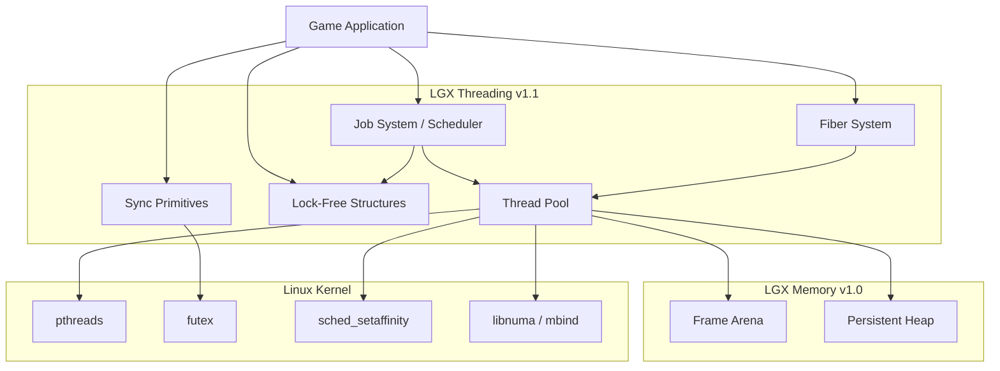

# Design Document: LGX Threading Module (v1.1)

## Overview

The LGX Threading Module provides a work-stealing job system, lock-free data structures, lightweight synchronization primitives, and optional fiber/coroutine support for Linux game development. It sits directly above the Memory Module in the LGX dependency graph and serves as the foundation for all subsequent modules (Graphics, Audio, Networking, Input).

The design prioritizes:
1. **Zero-overhead parallelism** — job submission < 100 ns, dispatch < 500 ns
2. **NUMA awareness** — thread pinning and NUMA-local memory for multi-socket systems
3. **Memory integration** — thread-local frame arenas from `lgx_memory` for per-job allocations
4. **Game-oriented patterns** — fiber-based async, frame-synchronized barriers, priority scheduling

## Architecture

### System Context



### Component Architecture

```mermaid
graph TB
    subgraph "Public API Layer"
        API_Job["lgx_job_*()"]
        API_Pool["lgx_thread_pool_*()"]
        API_Queue["lgx_mpmc_queue_*()"]
        API_Sync["lgx_mutex_*() / lgx_barrier_*()"]
        API_Fiber["lgx_fiber_*()"]
    end
    
    subgraph "Core Implementation"
        Scheduler[Work-Stealing Scheduler]
        WorkerLoop[Worker Thread Loop]
        Deques[Per-Core Work Deques]
        FiberCtx[Fiber Context Manager]
    end
    
    subgraph "Platform Abstraction"
        ThreadWrapper[Thread Create/Join/Pin]
        NUMADetect[NUMA Topology Detection]
        AtomicOps[C11 Atomics]
        FutexOps[Futex Wrappers]
    end
    
    API_Job --> Scheduler
    API_Pool --> WorkerLoop
    API_Queue --> AtomicOps
    API_Sync --> FutexOps
    API_Fiber --> FiberCtx
    
    Scheduler --> Deques
    Scheduler --> WorkerLoop
    WorkerLoop --> ThreadWrapper
    WorkerLoop --> NUMADetect
    FiberCtx --> ThreadWrapper
    
    Deques --> AtomicOps
```



## Components and Interfaces

### 1. Job System

The job system uses a **work-stealing scheduler** inspired by Cilk and Naughty Dog's fiber-based engine.

**Per-core deques:**
- Each worker thread owns a deque (double-ended queue)
- Local pushes and pops are LIFO (hot cache)
- Steals from other workers are FIFO (cold, but load balance)

```c
// Public API
typedef struct lgx_job_system_s* lgx_job_system_t;
typedef struct lgx_job_handle_s* lgx_job_handle_t;

typedef void (*lgx_job_func_t)(void* data, uint32_t thread_index);

typedef enum {
    LGX_JOB_PRIORITY_LOW      = 0,
    LGX_JOB_PRIORITY_NORMAL   = 1,
    LGX_JOB_PRIORITY_HIGH     = 2,
    LGX_JOB_PRIORITY_CRITICAL = 3
} lgx_job_priority_e;

typedef struct {
    uint32_t struct_size;
    lgx_job_func_t func;
    void* data;
    lgx_job_priority_e priority;
    lgx_job_handle_t parent;    // NULL = no parent
} lgx_job_desc_t;

// Submit a single job
lgx_threading_error_e lgx_job_submit(
    lgx_job_system_t system,
    const lgx_job_desc_t* desc,
    lgx_job_handle_t* out_handle
);

// Submit a batch of jobs atomically
lgx_threading_error_e lgx_job_submit_batch(
    lgx_job_system_t system,
    const lgx_job_desc_t* descs,
    size_t count,
    lgx_job_handle_t* out_handles
);

// Wait for a job to complete (does useful work while waiting)
lgx_threading_error_e lgx_job_wait(lgx_job_handle_t handle);

// Check if a job is complete (non-blocking)
bool lgx_job_is_complete(lgx_job_handle_t handle);
```

**Work-stealing algorithm:**
```
Worker thread loop:
1. Pop from local deque (LIFO — hot cache locality)
2. If empty, attempt steal from random victim (FIFO — distribute oldest work)
3. If no work found, spin briefly then park on futex
4. On new job signal, wake and retry from step 1
```

### 2. Thread Pool

```c
typedef struct lgx_thread_pool_s* lgx_thread_pool_t;

typedef struct {
    uint32_t struct_size;
    uint32_t thread_count;     // 0 = auto (physical cores)
    bool numa_aware;           // Pin threads to NUMA nodes
    bool set_thread_names;     // Name threads for debugger
    size_t per_thread_arena;   // Per-thread frame arena size (0 = default 2MB)
    const char* name_prefix;   // Thread name prefix (e.g., "lgx_worker")
} lgx_thread_pool_config_t;

lgx_threading_error_e lgx_thread_pool_create(
    const lgx_thread_pool_config_t* config,
    lgx_thread_pool_t* out_pool
);

void lgx_thread_pool_destroy(lgx_thread_pool_t pool);

// Statistics
typedef struct {
    uint32_t total_threads;
    uint32_t active_threads;
    uint32_t idle_threads;
    uint64_t total_jobs_executed;
    uint64_t total_steals;
    double avg_utilization;     // 0.0 - 1.0
} lgx_thread_pool_stats_t;

lgx_threading_error_e lgx_thread_pool_get_stats(
    lgx_thread_pool_t pool,
    lgx_thread_pool_stats_t* stats
);
```

### 3. Lock-Free Data Structures

#### MPMC Bounded Queue

```c
typedef struct lgx_mpmc_queue_s* lgx_mpmc_queue_t;

lgx_threading_error_e lgx_mpmc_queue_create(
    size_t capacity,            // Must be power of 2
    size_t element_size,
    lgx_mpmc_queue_t* out_queue
);

void lgx_mpmc_queue_destroy(lgx_mpmc_queue_t queue);

// Returns LGX_THREADING_ERROR_QUEUE_FULL if full
lgx_threading_error_e lgx_mpmc_queue_push(
    lgx_mpmc_queue_t queue,
    const void* element
);

// Returns LGX_THREADING_ERROR_QUEUE_EMPTY if empty
lgx_threading_error_e lgx_mpmc_queue_pop(
    lgx_mpmc_queue_t queue,
    void* out_element
);

size_t lgx_mpmc_queue_size(lgx_mpmc_queue_t queue);
```

**Implementation:** Dmitry Vyukov's bounded MPMC queue using per-slot sequence counters — O(1) push/pop, no CAS retry loops on the fast path.

#### SPSC Queue

```c
typedef struct lgx_spsc_queue_s* lgx_spsc_queue_t;

lgx_threading_error_e lgx_spsc_queue_create(
    size_t capacity,
    size_t element_size,
    lgx_spsc_queue_t* out_queue
);

void lgx_spsc_queue_destroy(lgx_spsc_queue_t queue);

lgx_threading_error_e lgx_spsc_queue_push(lgx_spsc_queue_t queue, const void* element);
lgx_threading_error_e lgx_spsc_queue_pop(lgx_spsc_queue_t queue, void* out_element);
```

**Implementation:** Cache-line padded head/tail indices with release/acquire ordering. Zero contention — ideal for main-thread ↔ render-thread communication.

### 4. Synchronization Primitives

All primitives use Linux futex for minimal-overhead parking:

```c
// Lightweight mutex (futex-based, 4 bytes)
typedef struct { _Atomic uint32_t state; } lgx_mutex_t;

lgx_threading_error_e lgx_mutex_init(lgx_mutex_t* mutex);
lgx_threading_error_e lgx_mutex_lock(lgx_mutex_t* mutex);
lgx_threading_error_e lgx_mutex_try_lock(lgx_mutex_t* mutex);
void lgx_mutex_unlock(lgx_mutex_t* mutex);

// Barrier (reusable, N threads)
typedef struct lgx_barrier_s* lgx_barrier_t;

lgx_threading_error_e lgx_barrier_create(uint32_t count, lgx_barrier_t* out_barrier);
lgx_threading_error_e lgx_barrier_wait(lgx_barrier_t barrier);
void lgx_barrier_destroy(lgx_barrier_t barrier);

// Read-write lock
typedef struct { _Atomic uint32_t state; } lgx_rwlock_t;

lgx_threading_error_e lgx_rwlock_init(lgx_rwlock_t* lock);
lgx_threading_error_e lgx_rwlock_read_lock(lgx_rwlock_t* lock);
lgx_threading_error_e lgx_rwlock_write_lock(lgx_rwlock_t* lock);
void lgx_rwlock_read_unlock(lgx_rwlock_t* lock);
void lgx_rwlock_write_unlock(lgx_rwlock_t* lock);
```

**Mutex implementation (3-state futex):**
```
State 0: Unlocked
State 1: Locked, no waiters (CAS to acquire, no syscall)
State 2: Locked, with waiters (futex_wait on lock, futex_wake on unlock)
```

### 5. Fiber System

```c
typedef struct lgx_fiber_s* lgx_fiber_t;

typedef struct {
    uint32_t struct_size;
    size_t stack_size;          // Default: 64KB
    uint32_t pool_size;         // Pre-allocated fiber count (default: 128)
} lgx_fiber_config_t;

typedef void (*lgx_fiber_func_t)(void* data);

lgx_threading_error_e lgx_fiber_create(
    lgx_fiber_func_t func,
    void* data,
    lgx_fiber_t* out_fiber
);

// Yield current fiber — resume later
void lgx_fiber_yield(void);

// Suspend fiber until job completes — run other fibers meanwhile
lgx_threading_error_e lgx_fiber_wait_job(lgx_job_handle_t job);

void lgx_fiber_destroy(lgx_fiber_t fiber);
```

**Implementation:** `swapcontext()` / `makecontext()` for portability, with optional assembly fast path for x86_64 (saves only callee-saved registers — 6 registers + rsp + rip = ~50 ns switch).

### 6. Memory Integration

```
Per Worker Thread:
┌──────────────────────────────┐
│ Thread-Local Frame Arena     │ ← 2 MB (from lgx_memory)
│ ┌──────────────────────────┐ │
│ │ Job 1 temp allocations   │ │ ← Reset after job completes
│ │ Job 2 temp allocations   │ │
│ └──────────────────────────┘ │
├──────────────────────────────┤
│ Per-Core Work Deque          │ ← Persistent heap allocation
│ (1024 job slots × 64 bytes)  │
├──────────────────────────────┤
│ Fiber Stack Pool             │ ← mmap'd, guard-page protected
│ (16 fibers × 64KB each)     │
└──────────────────────────────┘
```

## Data Models

### Job Handle (Internal)

```c
typedef struct {
    _Atomic uint32_t remaining_children;  // Counts down to 0
    _Atomic uint32_t completion_flag;     // 0 = pending, 1 = done
    lgx_job_func_t func;
    void* data;
    lgx_job_priority_e priority;
    struct lgx_job_internal_s* parent;
    uint64_t submit_time_ns;
    uint64_t start_time_ns;
    uint32_t worker_index;
} lgx_job_internal_t;
```

### NUMA Topology

```c
typedef struct {
    uint32_t node_count;
    uint32_t cores_per_node[LGX_MAX_NUMA_NODES];
    uint32_t core_to_node[LGX_MAX_CORES];
    size_t node_memory_bytes[LGX_MAX_NUMA_NODES];
} lgx_numa_topology_t;
```

## Correctness Properties

### Property 1: Progress Guarantee

*For any* submitted job, the job SHALL eventually execute and complete, provided the thread pool is not shut down. No job SHALL be silently dropped.

**Validates: Requirement 1.1, 1.5**

### Property 2: DAG Ordering

*For any* job with children, the parent job SHALL not report completion until all child jobs have completed.

**Validates: Requirement 1.3**

### Property 3: MPMC Linearizability

*For any* sequence of concurrent push/pop operations on an MPMC queue, the observable order SHALL be consistent with some sequential execution of those operations.

**Validates: Requirement 3.1**

### Property 4: Mutex Mutual Exclusion

*For any* mutex, at most one thread SHALL hold the lock at any time. No two concurrent `lgx_mutex_lock` calls on the same mutex SHALL both succeed without an intervening `lgx_mutex_unlock`.

**Validates: Requirement 4.1**

### Property 5: Barrier Synchronization

*For any* barrier with count N, exactly N threads SHALL be released simultaneously when the Nth thread arrives.

**Validates: Requirement 4.3**

### Property 6: Fiber Stack Isolation

*For any* fiber, writes to the fiber's stack SHALL not corrupt any other fiber's stack or the host thread's stack.

**Validates: Requirement 6.1, 6.6**

### Property 7: No Data Races

*For any* pair of concurrent accesses to shared state within the module's public API, the accesses SHALL be ordered by happens-before relationships (atomics, locks, or sequencing). ThreadSanitizer SHALL report zero races.

**Validates: Requirements 3.6, 4**

### Property 8: Memory Lifetime Correctness

*For any* thread-local frame arena used by a job, allocations made during job execution SHALL remain valid until the job completes. The arena SHALL not be reset while any job is actively using it.

**Validates: Requirement 5.4**

## Error Handling

```c
typedef enum {
    LGX_THREADING_SUCCESS                = 0,
    LGX_THREADING_ERROR_INVALID_PARAM    = -1,
    LGX_THREADING_ERROR_OUT_OF_MEMORY    = -2,
    LGX_THREADING_ERROR_NOT_INITIALIZED  = -3,
    LGX_THREADING_ERROR_ALREADY_INIT     = -4,
    LGX_THREADING_ERROR_QUEUE_FULL       = -100,
    LGX_THREADING_ERROR_QUEUE_EMPTY      = -101,
    LGX_THREADING_ERROR_TIMEOUT          = -102,
    LGX_THREADING_ERROR_DEADLOCK         = -103,
    LGX_THREADING_ERROR_FIBER_OVERFLOW   = -104,
    LGX_THREADING_ERROR_POOL_SHUTDOWN    = -105,
} lgx_threading_error_e;
```

Thread-local error details follow the platform pattern:

```c
const char* lgx_threading_get_last_error_detail(void);
const char* lgx_threading_error_string(lgx_threading_error_e error);
```

## Testing Strategy

### Unit Tests
- Job system: submit/wait/cancel, priority ordering, parent-child DAG
- Lock-free structures: sequential correctness, boundary conditions
- Sync primitives: lock/unlock, barrier counting, rwlock reader parallelism
- Fibers: create/yield/resume, nested fibers, stack overflow detection

### Concurrency Tests (ThreadSanitizer)
- Compile with `-fsanitize=thread`, run all concurrent tests
- Stress test: 1M jobs across 8 threads, verify zero TSan warnings
- MPMC queue: 4 producers × 4 consumers × 1M operations
- Mutex: 8 threads incrementing shared counter (verify exact count)

### Property-Based Tests (min 100 iterations each)
- Random job DAGs: verify completion order respects dependencies
- Random queue operations: verify linearizability
- Random lock/unlock patterns: verify mutual exclusion

### Performance Tests
- Job submission latency: measure P50/P99 with varying contention
- Work-stealing efficiency: compare to single-threaded, measure speedup
- Queue throughput: ops/sec under varying producer/consumer ratios
- Fiber switch latency: measure context switch overhead

### Integration Tests
- Threading + Memory: verify thread-local arenas allocate from correct NUMA node
- Job system + Frame arena: verify arena reset does not corrupt active job data
- Standalone mode: verify module works without `lgx_memory` (uses malloc fallback)
